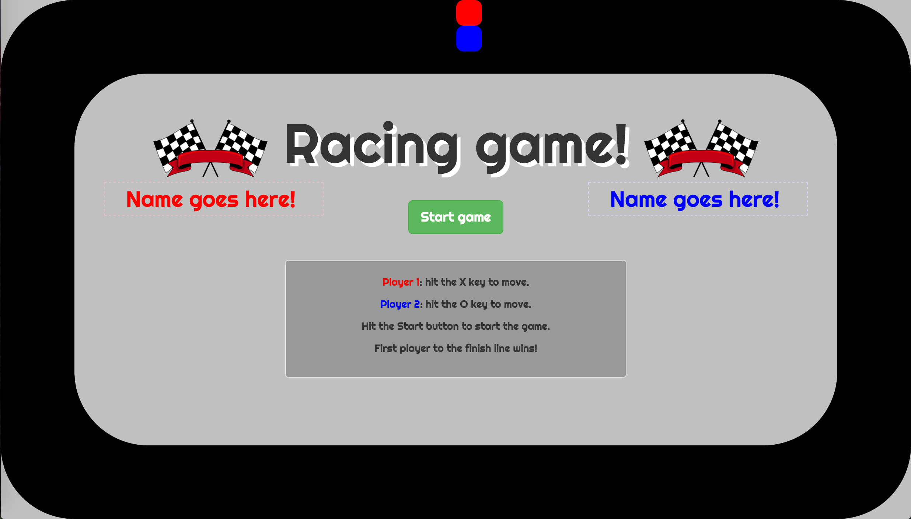

# Race car game

This game pits your key pressing speed against that of your opponent as you race around the track.

## Technologies used

* Javascript

* jQuery

* Bootstrap

* Google fonts

* CSS 

* HTML

## Existing features

* Used an array of positions, as players move around the track.

* Position absolute: each player is at a specific position on the page.

* Hide and show for the Start/Reset button and the finish line.

* Animate: animates movement positions.

* Layering: used z-indexes of inner gray piece above black outer piece to create racetrack.

* Positions are set as percentages: the game works on smaller screens as well.

## Planned Features
* Customizeable car and text colors for each player, and along with avatar options.

* Count down timer to race start.

* Level 2 with a figure-eight race track layout.

